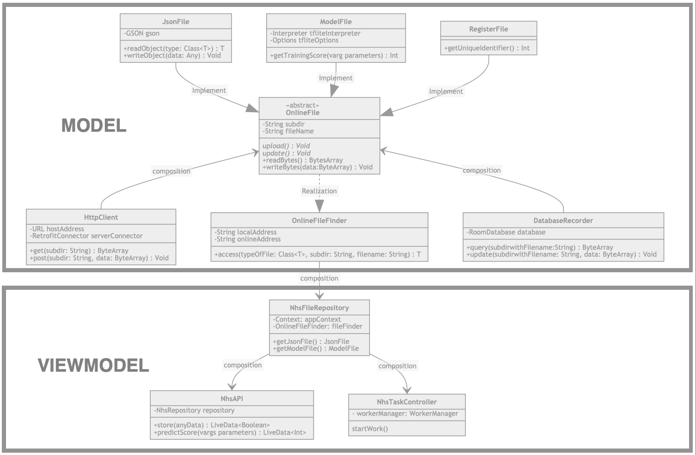
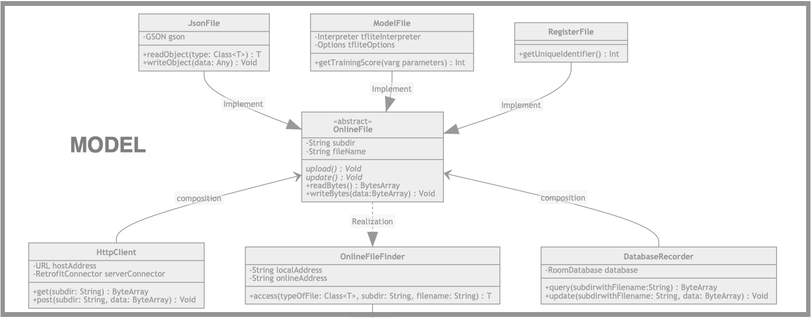
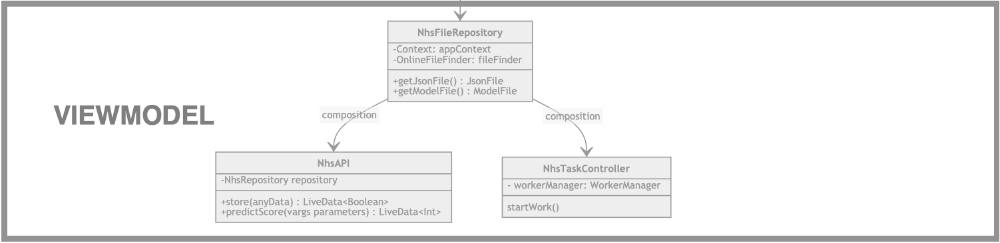

# NHSX APIs on Android
## 1. Description

It is the NHSX APIs on Android sides, it provides Android applications with capabilities of object converting and json file uploading, as well as, the Tensorflow model updating and local predicting.

Besides, the project depends on the open library below.

| Retrofit2 | Gson | Guava | Tensorflow-Lite | Android.Room | Android.Worker |
|:------------|:------------|:------|:------------|:------|:------------|
| 2.7.1 | 2.8.6 | 28.2 | 0.0.0-nightly | 2.2.4 | 2.3.3 |

## 2. Import it into your project

### 2.1 Requisites

Because of the limitation of the Tensorflow lite library, android room database and android periodically worker manager mechanism, there are certain requisites for the development kits as the table below shows.

| JDK |  Android SDK |
|:------|:------------|
| 8 | 28.0 (Android9) |

### 2.2 For Java Developer

The package can be imported into an Android project simply by two steps. First: put the `.aar` into the library directory. Second: add a dependency in your `build.gradle` file as the codes section below. 

``` gradle
android {
    ...
}

dependencies {
    implementation project(path: 'path for the .aar file')
}

```

### 2.3 For Kotlin Developer

It is essential to add an additional specification for the code compiler, so the `build.gradle` file should look like the code section below: 

``` gradle
android {
    ...
    compileOptions {
        sourceCompatibility JavaVersion.VERSION_1_8
        targetCompatibility JavaVersion.VERSION_1_8
    }
}

dependencies {
    implementation project(path: 'path for the .aar file')
}

```

## 3. Usage

### 3.1 NhsAPI

There is a viewmodel class NhsAPI providing a series of functions for the NHS Android application to record personal data and to calculate the wellbeing score. Besides, it completely follows the design of the MVVM, so that any android application using the design pattern can simply integrate with the class

#### 3.1.1 Initiation

For the kotlin developer, 

```kotlin
// In the Android Fragment or Android Activity, 
// It can be created by the view model provider.
val nhsAPI = ViewModelProvider(this).get(NhsAPI::class.java)

// Alternatively to directly use its constructor
val application = context.getApplicationContext() as Application
val nhsAPI = NhsAPI(application)
```

For the Java developer, the syntax is almost same 

```java
// In the Android Fragment or Android Activity, 
// It can be created by the view model provider.
NhsAPI nhsAPI = ViewModelProvider(this).get(NhsAPI.class)

// Alternatively to directly use its constructor
Application application = (Application) context.getApplicationContext()
NhsAPI nhsAPI = NhsAPI(application)
```

#### 3.1.2 Record Data

The class provides a method for recording data, which accepts the instance of any class. It can automatically extract the numbers and strings fields from the input instance.

```kotlin 
fun record(data: Any): LiveData<Boolean> 
```

To use the method, it is essential to specify which data are needed  by an annotation. `@JsonFile.JsonData(name = "expected name in json file")`.  
For the Kotlin developer, it looks likes:

```Kotlin
data class Data(
    @JsonFile.JsonData(name="stepCount")
    field_01: Int = 100, 
    @JsonFile.JsonData(name="callCount")
    field_02: Int = 100,
    @JsonFile.JsonData(name="msgCount")
    field_03: Int = 100
){}

nhsAPI.record(Data())

```

For the Java developer, it looks likes:

```Java
class Data{
    @JsonFile.JsonData(name="stepCount")
    int field_01 = 100;
    @JsonFile.JsonData(name="callCount")
    int field_02 = 100;
    @JsonFile.JsonData(name="msgCount")
    int field_03 = 100;
}

nhsAPI.record(new Data())

```


If an instance of the `Data` class is passed into the method, the `field_01` and `field_02` will be stored into josn file as the code below: 

```json
{"stepCount": 100, "callCount": 100, "msgCount": 100}
```

#### 3.1.2 Training Score

There is also a method for accessing the training score of the machine learning model and besides a method to require update of the training score. 

```kotlin 
fun getTrainingScore(): LiveData<Int>

fun updateTrainingScore(): Unit 
```

For the Kotlin developer, 

``` kotlin
nhsAPI.getTrainingScore().observe(viewLifecycleOwner, Observer {trainingScore ->
    //Specify action to do, if the training score change
})
nhsAPI.updateTrainingScore() // update training score
```

For the Java developer, 

``` java
// Create an anonymous class of the interface Observer 
Observer<Integer> scoreObserver = new Observer<Integer>(){
    @Override 
    void onChange(Integer score){
        //Specify action to do, if the training score change
    }
}
nhsAPI.getTrainingScore().observe(viewLifecycleOwner,scoreObserver)

nhsAPI.updateTrainingScore() // update training score
```

### 3.2 NhsSynchroniser

It is a class which is used to create weekly tasks for uploading the json file and downloading the tensorflow lite model.

#### 3.2.1 Initiation

It can be simply initiated without any parameters. 

```kotlin
// In kotlin
val synchroniser = NhsSynchroniser()
```
```java 
//In java
NhsSynchroniser synchroniser = new NhsSynchroniser()
```

The tasks can be created by two methods directly as below

```kotlin
// In upload the json file once a week
startJsonUploadTask()
// In download the model file once a week
startModelDownloadTask()
```

## 4. Design

### 4.1 Overall
As to the design, the package completely follows the "MVVM", aka "Model View ViewModel" design pattern, in which there are three different kinds of classes: the "Model" class for data handling; the "View" class for UI updating; the "ViewModel" class for data sharing between both views with models and different views. The pattern enforces the single responsibility principle to certain extents, therefore it makes the package highly-integratable for the Android applications, which is the main reason why we choose the pattern. And besides, it is released and officially recommended by Google, therefore it is reasonable to believe that the pattern will be the main-stream of the architecture of Android application.  

To be more relative to the package, Figure below shows an overall structure of the package. It implements both the "Model" and the "ViewModel": the former is responsible for the basic functionalities including the HTTP requests generating and sending, as well as the machine learning predicting; the latter encapsulates all model classes, and provides app developers with a series of interfaces for storing the personal information of app users, calculating the well-being score, and managing periodical file update and download tasks.



### 4.2 Model Part 

In terms of the model part, it is completely isolated to the bussiness domain of NHSX, therefore it is highly-reusable for other projects, which have similar requirements. the "OnlineFile" class rewrites the "Java.File" class, which provides an interface to persistently store binary data by the "DatabaseRecorder" class, and it is also an abstract class specifying two abstract methods about networking. Therefore its subclasses, "JsonFile", "ModelFile" and "RegisterFile", not only are responsible for Json string converting, Machine learning predicting and registering respectively, but also implements file updating and uploading by the "HttpClient" class. There is also a factory class, "OnlineFileFinder", for creating the "OnlineFile" by reflection mechanism. Finally, the "DatabaseRecorder" and "HttpClient" are wrapper classes encapsulating two outside libraries: "AndroidX.room" and "Retrofits2".  



### 4.3 ViewModel Part 


